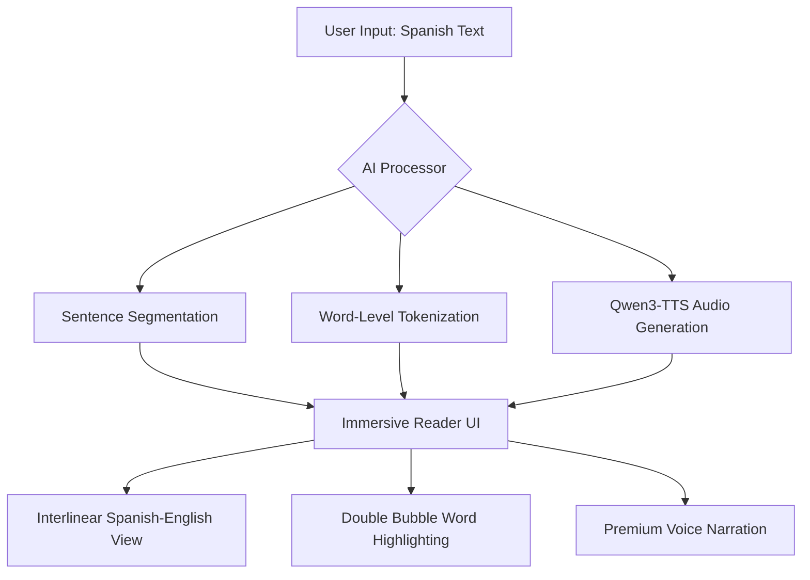

# Spanish Learning App

A web application that mimics Spotify's translated lyrics feature for books.

## Getting Started

To run the application, you need to start both the backend and the frontend.

### Prerequisites
- Python 3.10+
- Node.js 18+
- npm

---

### Quick Start (Recommended)

**Windows:**
1. Double-click `setup.bat` to automatically install all required frontend and backend dependencies.
2. Double-click `run.bat` to launch both servers simultaneously in their own windows.

**Mac/Linux:**
1. Make the scripts executable: `chmod +x setup.sh run.sh`
2. Run `./setup.sh` to install all dependencies.
3. Run `./run.sh` to start the frontend and backend concurrently.

---

### Manual Setup

#### 1. Launch the Backend (FastAPI)

1. Navigate to the backend directory:
   ```bash
   cd backend
   ```
2. Install dependencies:
   ```bash
   pip install -r requirements.txt
   ```
3. Run the server:
   ```bash
   python main.py
   ```
   The backend will be available at `http://localhost:8000`.

#### 2. Launch the Frontend (Next.js)

1. Open a **new** terminal window and navigate to the frontend directory:
   ```bash
   cd frontend
   ```
2. Install dependencies:
   ```bash
   npm install
   ```
3. Run the development server:
   ```bash
   npm run dev
   ```
   The frontend will be available at `http://localhost:3000`.

---

## Wireframe & Design Process

The development of Hermes followed a multi-stage refinement process to transform a standard translator into a premium immersive reader.

### 1. Conceptual Flow
The goal was to move from a "Fragmented UI" to a "Document-First" experience.



### 2. Design Evolution
- **Phase 1: Basic Translator**: Simple input/output with sentence-level translation.
- **Phase 2: Speechify Redesign**: Introduced the "Document View" using high-quality serif typography (Inter & Playfair Display) and a minimalist white palette.
- **Phase 3: Interlinear Focus**: Added word-by-word translations directly underneath the Spanish text to prevent context switching.
- **Phase 4: Immersion Fixes**: Developed the "Double Bubble" highlighting system, ensuring the visual focus follows the AI narrator exactly.

### 3. Architecture
Hermes uses a decoupled architecture for maximum local performance:
- **FastAPI Backend**: Orchestrates Ollama (LLM) for translation and the Qwen3-TTS 0.6B model for local voice synthesis.
- **Next.js Frontend**: Manages the reactive state for the immersive player and word-level synchronization.

---

## Project Structure

- `frontend/`: Next.js web application.
- `backend/`: FastAPI Python server.
- `AI-Plan.md`: Technical roadmap and architecture details.
